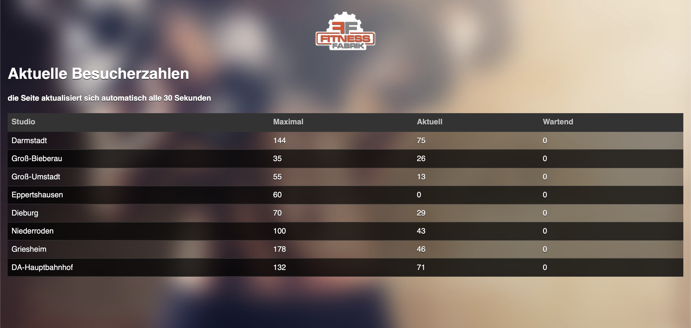

### This python program that web-scrapes
This Python program uses [Beautiful Soup](https://www.crummy.com/software/BeautifulSoup/bs4/doc/) to traverse and search an HTML document, and extract the relevant data needed for the program. With Beautiful Soup, the program can extract specific elements and contents from HTML, XML, and other markup languages. The extracted data is then used to determine the current number of people training in the gym.

### Telegram bot integration

The program also integrates a Telegram bot that sends messages to users whenever the gym occupancy meets the desired criteria (minimum and maximum). The bot is connected through an easy-to-implement API request to the Telegram server, which allows the community to interact with the bot in an automated way. By setting the criteria for the minimum and maximum number of people in the gym, users can receive notifications only when the gym occupancy meets their preferences.

